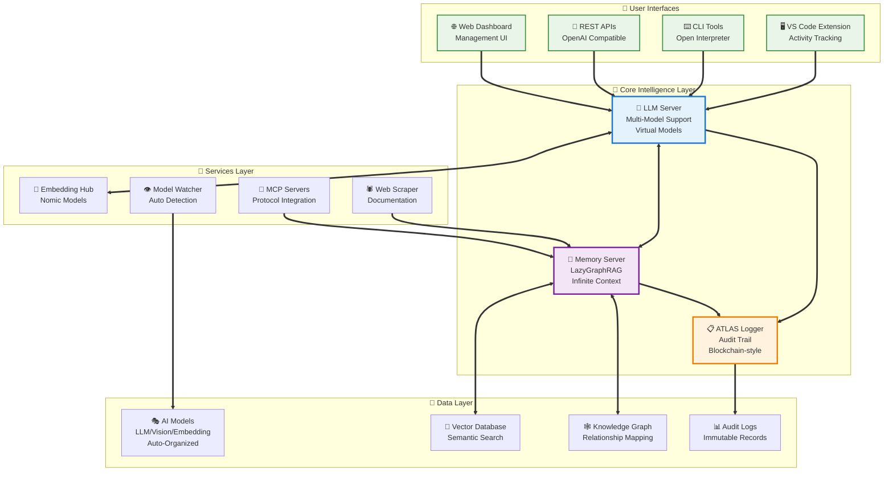
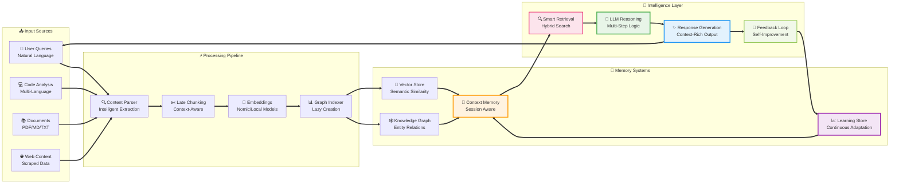

<div align="center">

# 🤖 **AI-SERVER**

### *Next-Generation AI Development Platform with Advanced Memory & Learning Systems*

<p align="center">


</p>

<p align="center">


</p>

</div>

---

A comprehensive AI infrastructure designed for intelligent automation, featuring **cutting-edge LazyGraphRAG memory systems**, **multi-modal LLM capabilities**, and **autonomous learning frameworks**. Built for researchers, developers, and enterprises who need powerful, scalable AI solutions that evolve with their needs.

## 🎯 Project Vision

AI-Server represents the future of intelligent systems - combining traditional language models with advanced memory architectures and continuous learning capabilities. Our platform bridges the gap between current AI limitations and the dream of truly adaptive, context-aware artificial intelligence.

<div align="center">

## 🤖 **AI-Native Development**

</div>

> **🚀 This project is being developed entirely with AI assistance**, implementing cutting-edge AI engineering methodologies:

<table align="center">
<tr>
<td align="center" width="33%">

### 🎯 **Prompt Engineering**
Advanced techniques for<br/>optimal AI collaboration

</td>
<td align="center" width="33%">

### 🏗️ **Modular Architecture**
AI-designed systems with<br/>clear separation of concerns

</td>
<td align="center" width="33%">

### ⚡ **State-of-the-Art**
Latest AI tools, frameworks<br/>and methodologies

</td>
</tr>
</table>

- **🎯 Advanced Prompt Engineering**: Using cutting-edge prompting techniques for optimal AI collaboration
- **🏗️ Modular Software Architecture**: AI-designed modular systems with clear separation of concerns
- **⚡ State-of-the-Art Components**: Integration of the latest AI tools, frameworks, and methodologies
- **🔄 AI-Human Collaboration**: Seamless partnership between human vision and AI implementation
- **📈 Continuous AI Learning**: The development process itself evolves through AI feedback loops

This represents a new paradigm in software development - where AI is not just a tool, but a collaborative partner in creating the next generation of intelligent systems.

<div align="center">

### ✨ **Core Innovations**

</div>

<table>
<tr>
<td width="50%">

#### 🧠 **LazyGraphRAG Memory**
Revolutionary memory system that scales beyond traditional context limits

#### 🔄 **Adaptive Learning**  
Continuous improvement through interaction and feedback

</td>
<td width="50%">

#### 🌐 **Multi-Modal Intelligence**
Unified processing of text, code, images, and documents

#### ⚡ **Performance First**
Optimized for Apple Silicon with enterprise-grade reliability

</td>
</tr>
</table>

<div align="center">

### 🚀 **Upcoming Breakthroughs**

> **Transformers 2 Integration**: Next-generation attention mechanisms with continuous learning between attention layers and memory systems, enabling true adaptive intelligence as the project evolves

</div>

---

<div align="center">

## 🏗️ **System Architecture**

</div>

<p align="center">


</p>

<div align="center">



</div>

<div align="center">

## 🔄 **Data Flow Architecture**

*Advanced memory-attention fusion with continuous learning loops*

</div>

<div align="center">



</div>

---

## 📋 System Inventory

**Complete component listing and status:**
- 📄 **[INVENTORY.md](INVENTORY.md)** - Human-readable complete system inventory
- 🔧 **[system-inventory.json](system-inventory.json)** - Machine-readable component catalog

## 🚀 Quick Start

```bash
# Start entire AI ecosystem
./bin/start_ai_server.py

# Or use shell version
./bin/start_servers.sh

# Individual services
./bin/start_llm.sh      # LLM Server only
./bin/start_memory.sh   # Memory Server only
```

## 🏗️ Enterprise Architecture

```
AI-server/
├── 📱 apps/              # User-facing applications
│   ├── llm-server/      # Main LLM API Server
│   ├── memory-server/   # LazyGraphRAG Memory System
│   └── dashboard/       # Web UI (planned)
│
├── 🔧 services/         # Background support services
│   ├── model-watcher/   # Automatic model detection
│   ├── vector-db/       # Vector database (planned)
│   └── auth-service/    # Authentication (planned)
│
├── 🛠️ tools/            # Development utilities
│   ├── cli-interfaces/  # AI CLI tools (OpenInterpreter, OpenCode)
│   ├── vscode-extension/# VS Code integration
│   ├── web-scraper/     # Documentation scraper
│   └── mcp-servers/     # MCP protocol servers
│
├── 🎯 assets/           # Organized resources
│   ├── models/         # AI models (LLM, embedding, vision)
│   ├── prompts/        # Prompt templates
│   └── datasets/       # Training data
│
├── ⚡ bin/              # Executable scripts
├── 📦 src/              # Shared source code
├── ⚙️ config/           # Environment configurations
├── 📊 monitoring/       # Observability
├── 🔒 security/         # Security assets
└── 📋 logs/             # ATLAS - Automated audit trail
```

**Why This Architecture?**
- ✅ **Team Scalability**: Clear ownership boundaries
- ✅ **Independent Deployment**: Each app/service deploys separately  
- ✅ **Industry Standard**: Follows patterns from Microsoft, Google, Netflix
- ✅ **Future-Proof**: Ready for microservices and team growth

> 📚 **Read the full rationale**: [Architecture Decision Record](./docs/architecture/ADR-001-Directory-Structure.md)

## 🎯 Virtual AI Models

| Model | Purpose | Optimized For |
|-------|---------|---------------|
| `cline-optimized` | Cline IDE integration | PLAN/ACT modes, multimodal |
| `openai-compatible` | OpenAI API standard | 100% API compatibility |
| `multimodal-enhanced` | Complex analysis | Text + Images + Documents |
| `thinking-enabled` | Deep reasoning | Always-on reasoning mode |

## 📡 Service Endpoints

### 🧠 LLM Server
- **URL**: `http://localhost:8000`
- **API**: `/v1/chat/completions` (OpenAI compatible)
- **Docs**: `/docs`
- **Health**: `/health`

### 💾 Memory Server  
- **URL**: `http://localhost:8001`
- **API**: `/api/v1/`
- **Technology**: LazyGraphRAG
- **Health**: `/health/status`

### 👁️ Model Watcher
- **Function**: Background service
- **Monitors**: `assets/models/` directory
- **Auto-organizes**: Models by type (LLM, embedding, vision)

### 📋 ATLAS (Automated Logging)
- **Function**: Enterprise audit trail
- **Records**: Every operation automatically
- **Immutable**: Blockchain-style integrity
- **Compliance**: SOX, GDPR, ISO27001 ready

## ⚡ Core Features

### 🎭 Multi-App Architecture
- **Modular Design**: Independent applications and services
- **Scalable**: Add new apps without affecting existing ones
- **Team-Ready**: Clear ownership and development boundaries

### 🧠 Intelligent Memory
- **LazyGraphRAG**: Advanced retrieval-augmented generation
- **Infinite Context**: Beyond traditional token limits
- **Multimodal**: Text, images, documents, code

### 🔥 Performance Optimized
- **M1/M2/M3 Optimized**: Metal acceleration
- **55+ tokens/sec**: High throughput on Apple Silicon
- **<100ms**: First token latency
- **128K native context**: Large context windows

### 🔌 Universal Compatibility
- **OpenAI Drop-in**: 100% API compatibility
- **IDE Integration**: Cline, Cursor, Continue, VS Code
- **Multiple Languages**: Python, JavaScript, REST API

## 🛠️ Development Tools

### 🖥️ CLI Interfaces
- **Open Interpreter**: Full-featured AI assistant
- **OpenCode**: Code-focused AI helper
- **Unified Access**: Consistent experience across tools

### 🔧 IDE Extensions
- **VS Code Activity Tracker**: Development workflow integration
- **Cline Integration**: Optimized PLAN/ACT modes
- **Real-time Sync**: Activity tracking and context sharing

### 🕷️ Data Collection
- **Web Scraper**: Automated documentation ingestion
- **MCP Servers**: Model Context Protocol integration
- **Smart Processing**: Intelligent content extraction

## ⚙️ Configuration

### IDE Setup (Cline)
```json
{
  "cline.apiProvider": "openai-compatible",
  "cline.openaiCompatible.baseUrl": "http://localhost:8000/v1",
  "cline.openaiCompatible.apiKey": "sk-llmserver-local",
  "cline.openaiCompatible.modelId": "cline-optimized"
}
```

### Python Integration
```python
import openai

client = openai.OpenAI(
    api_key="sk-llmserver-local",
    base_url="http://localhost:8000/v1"
)

response = client.chat.completions.create(
    model="cline-optimized",
    messages=[{"role": "user", "content": "Hello AI!"}]
)
```

### cURL Examples
```bash
# Chat completion
curl -X POST http://localhost:8000/v1/chat/completions \\
  -H "Content-Type: application/json" \\
  -H "Authorization: Bearer sk-llmserver-local" \\
  -d '{
    "model": "cline-optimized",
    "messages": [{"role": "user", "content": "Hello!"}]
  }'

# Memory search
curl -X POST http://localhost:8001/api/v1/search \\
  -H "Content-Type: application/json" \\
  -d '{
    "query": "machine learning concepts",
    "limit": 5
  }'
```

## 📊 System Requirements

| Component | Minimum | Recommended | Optimal |
|-----------|---------|-------------|---------|
| **CPU** | M1 | M1 Pro/Max | M1/M2/M3 Ultra |
| **RAM** | 16GB | 32GB | 64GB+ |
| **Storage** | 100GB | 200GB | 500GB+ |
| **macOS** | 12.0+ | 13.0+ | 14.0+ |

**Additional Requirements**:
- Python 3.8+
- Node.js 18+ (for tools)
- Docker (optional, for deployment)

## 🔧 Installation & Setup

```bash
# 1. Clone repository
git clone <repository-url> AI-server
cd AI-server

# 2. Run setup script
./bin/setup.sh

# 3. Download models (will be organized automatically)
# Drop .gguf files into assets/models/llm/

# 4. Start services
./bin/start_ai_server.py
```

## 🚨 Troubleshooting

| Issue | Solution |
|-------|----------|
| Port 8000 in use | `lsof -i:8000` and kill process |
| Memory Server fails | Check port 8001 availability |
| Models not loading | Verify `assets/models/llm/` permissions |
| Service won't start | Run `./bin/setup.sh` first |
| Import errors | Check Python path and dependencies |

## 📈 Performance Metrics

### 🏃‍♂️ Throughput (M1 Ultra)
- **Text Generation**: 55+ tokens/second
- **Code Completion**: 45+ tokens/second  
- **Multimodal**: 30+ tokens/second

### ⚡ Latency
- **First Token**: <100ms
- **API Response**: <50ms
- **Memory Search**: <200ms

### 🧠 Context Handling
- **Native Context**: 128K tokens
- **Extended Context**: Unlimited (via LazyGraphRAG)
- **Memory Retention**: Persistent across sessions

## 🔐 Security

- **Local-Only**: No external dependencies by default
- **API Authentication**: Bearer token security
- **Isolated Services**: Process isolation
- **Audit Logging**: Comprehensive activity logs
- **Configuration Security**: Environment-based secrets

## 📚 Documentation

### 🏗️ Architecture
- [📋 Architecture Decision Records](./docs/architecture/)
- [🏢 Project Structure Guide](./docs/architecture/Project-Structure.md)
- [🔗 Service Communication](./docs/architecture/Service-Communication.md)

### 🔌 API Reference
- [🧠 LLM Server API](./docs/api/llm-server-api.md)
- [💾 Memory Server API](./docs/api/memory-server-api.md)

### 🚀 Deployment
- [🐳 Docker Deployment](./docs/deployment/docker.md)
- [☸️ Kubernetes Setup](./docs/deployment/kubernetes.md)
- [🏭 Production Guide](./docs/deployment/production.md)

### 👩‍💻 Development
- [🛠️ Development Setup](./docs/development/setup.md)
- [🧪 Testing Guide](./docs/development/testing.md)
- [🤝 Contributing](./docs/development/contributing.md)

## 📈 Roadmap

### Phase 1 (Current)
- ✅ Multi-app architecture
- ✅ LLM Server with virtual models
- ✅ Memory Server with LazyGraphRAG
- ✅ CLI tools integration

### Phase 2 (Next)
- 🔄 Web Dashboard UI
- 🔄 Enhanced authentication
- 🔄 Vector database service
- 🔄 Advanced monitoring

### Phase 3 (Future)
- 🔄 **Transformers 2 Technology**: Next-gen attention mechanisms with continuous learning between attention and memory layers
- 🔄 Autonomous learning and adaptation systems
- 🔄 Kubernetes deployment
- 🔄 Multi-GPU support
- 🔄 Plugin ecosystem
- 🔄 Cloud deployment options
- 🔄 Mobile API gateway

### 🚀 Revolutionary Features (Planned)
- **🧠 Transformers 2 Integration**: Advanced attention-memory fusion enabling true continuous learning
- **🔄 Self-Improving Models**: AI systems that enhance themselves through usage patterns
- **🌟 Emergent Capabilities**: Unlock new AI behaviors through memory-attention symbiosis
- **📈 Adaptive Intelligence**: Systems that evolve and specialize based on user interactions

## 🛠️ AI Engineering Methodologies

This project showcases the power of modern AI-assisted development using cutting-edge techniques:

### 🎯 Prompt Engineering Excellence
- **Chain-of-Thought**: Complex reasoning through structured thinking
- **Few-Shot Learning**: Optimal examples for AI understanding
- **Task Decomposition**: Breaking complex problems into manageable parts
- **Context Optimization**: Maximizing AI comprehension and output quality

### 🏗️ Architecture Design Principles
- **Domain-Driven Design**: AI-assisted domain modeling and boundaries
- **Microservices Architecture**: Independently deployable, AI-designed components
- **Event-Driven Systems**: Reactive architectures for scalable AI systems
- **Clean Architecture**: Separation of concerns with AI-optimized patterns

### ⚡ State-of-the-Art Technology Stack
- **LazyGraphRAG**: Cutting-edge retrieval-augmented generation
- **ATLAS Logging**: Blockchain-inspired audit trails
- **MCP Protocol**: Model Context Protocol integration
- **Modern Python**: FastAPI, Pydantic, async/await patterns
- **TypeScript**: Type-safe development for robust tools

## 🤝 Contributing

We welcome contributions! Please see:

1. [Contributing Guide](./docs/development/contributing.md)
2. [Development Setup](./docs/development/setup.md) 
3. [Code Standards](./docs/development/code-standards.md)
4. [Testing Guidelines](./docs/development/testing.md)

## 📄 License

MIT License - See [LICENSE](./LICENSE)

---

## 🏷️ Project Status

**Version**: 3.0  
**Status**: 🟢 Production Ready  
**Architecture**: ✅ Enterprise Grade  
**Team Ready**: ✅ Multi-team scalable  
**Performance**: ⚡ M1 Ultra optimized  

**Maintained by**: Rubén Alvarez  
**Last Updated**: 2025-08-26