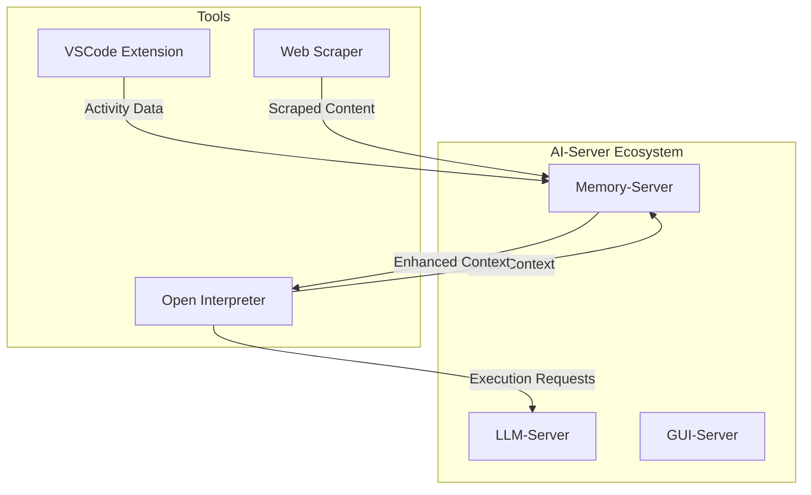

# AI-Server Tools

This directory contains external tools, integrations, and utilities for the AI-Server ecosystem.

## Directory Structure

```
tools/
├── mcp-servers/          # Model Context Protocol servers
│   └── memory-server-mcp/ # MCP server for Memory-Server integration
├── vscode-activity-tracker/ # VSCode extension for activity tracking
├── web-scraper/          # Web scraping utilities and configurations
├── open-interpreter/     # Customized Open Interpreter with AI-Server integration
├── opencode/            # OpenCode CLI with Memory-Server and Model Pool
├── model-watcher/       # Auto-organizer for model pool management
└── README.md            # This documentation
```

## Available Tools

### 🔌 MCP Servers

#### Memory-Server MCP
- **Path**: `mcp-servers/memory-server-mcp/`
- **Purpose**: Model Context Protocol server for Claude/LLM integration
- **Integration**: Direct Memory-Server API access
- **Features**:
  - Native Claude Code integration
  - Real-time document search and upload
  - Advanced summarization tools
  - Workspace management
  - Activity tracking

### 🔌 Extensions

#### VSCode Activity Tracker
- **Path**: `vscode-activity-tracker/`
- **Purpose**: Real-time development activity tracking
- **Integration**: Memory-Server workspace management
- **Features**: 
  - Intelligent auto-tagging
  - Offline support with sync
  - Privacy-focused content redaction
  - Workspace-aware organization

### 🌐 Web Scraper
- **Path**: `web-scraper/`
- **Purpose**: Advanced web content extraction
- **Integration**: Memory-Server ingestion pipeline
- **Features**:
  - Playwright browser automation
  - Serper/Firecrawl API integration
  - Batch processing capabilities
  - Intelligent content cleaning

### 🤖 Code Interpreters

#### Open Interpreter
- **Path**: `open-interpreter/`
- **Purpose**: Enhanced code execution with Memory-Server context
- **Integration**: LLM-Server and Memory-Server
- **Features**:
  - Memory-aware code execution
  - Context-enhanced completions
  - Workspace integration
  - Auto-save important work
  - Technical summarization

#### OpenCode CLI
- **Path**: `opencode/`
- **Purpose**: AI-powered code CLI assistant
- **Integration**: Model Pool and Memory-Server
- **Features**:
  - Automatic model selection from pool
  - Code search in Memory-Server
  - Snippet management
  - Session tracking
  - Technical documentation generation

### 🔧 Model Watcher
- **Path**: `model-watcher/`
- **Purpose**: Automatic model organization and management
- **Features**:
  - Auto-copies models to organized pool
  - Maintains README with usage tracking
  - Categories: llm/code, llm/chat, embedding, etc.
  - Physical copies for service isolation

## Usage Guidelines

### For Tool Developers

1. **Directory Structure**: Each tool should have its own directory with:
   ```
   tool-name/
   ├── README.md          # Comprehensive documentation
   ├── config/            # Configuration files
   ├── src/               # Source code
   ├── tests/             # Tool-specific tests
   └── docs/              # Additional documentation
   ```

2. **Naming Conventions**:
   - Use kebab-case for directory names
   - Include version in config files
   - Follow semantic versioning for releases

3. **Integration Points**:
   - Document all AI-Server service integrations
   - Use standardized configuration patterns
   - Implement proper error handling and logging

### For Users

1. **Installation**: Each tool contains installation instructions in its README
2. **Configuration**: Check `configs/` for shared settings
3. **Documentation**: Refer to individual tool docs for usage details

## Integration Architecture



## Development Standards

### Code Quality
- Follow language-specific style guides
- Include comprehensive tests
- Document all public APIs
- Use type hints where applicable

### Security
- Never commit API keys or secrets
- Implement proper input validation
- Use secure communication protocols
- Regular security audits

### Performance
- Optimize for minimal resource usage
- Implement proper caching strategies
- Use async/await for I/O operations
- Monitor and log performance metrics

## Contributing

1. **New Tools**: Create proposal in main repository issues
2. **Bug Fixes**: Submit PRs with tests and documentation
3. **Enhancements**: Discuss design in GitHub discussions
4. **Documentation**: Keep all docs up to date

## License

All tools inherit the MIT license from the main AI-Server project unless otherwise specified.