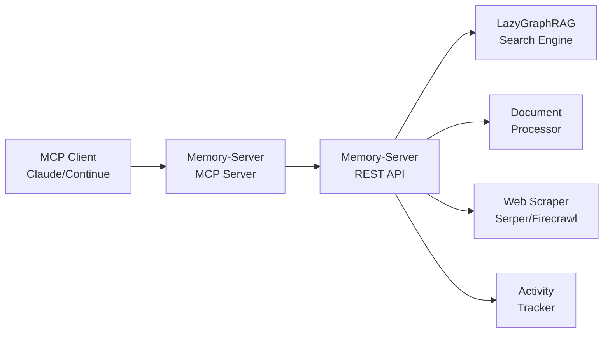

# Memory-Server MCP Server

Model Context Protocol (MCP) server for Memory-Server, enabling seamless integration with Claude, OpenAI, and other MCP-compatible LLMs.

## 🚀 Features

- **🔍 Advanced Search**: LazyGraphRAG-powered document search across workspaces
- **📄 Document Upload**: Intelligent document processing with auto-tagging
- **📝 Smart Summarization**: Advanced LLM-powered summaries with multiple types (extractive, abstractive, technical, etc.)
- **🌐 Web Scraping**: Advanced content extraction using Playwright + Serper/Firecrawl APIs
- **📊 Activity Tracking**: Development activity monitoring for contextual AI assistance
- **🗂️ Workspace Management**: Organized content silos for different project contexts
- **📈 Performance Metrics**: Real-time processing statistics and health monitoring

## 🛠️ Installation

```bash
cd tools/mcp-servers/memory-server-mcp
npm install
npm run build
```

## 📋 Prerequisites

- Memory-Server running on `http://localhost:8001` (or set `MEMORY_SERVER_URL`)
- Node.js 18+ with TypeScript support
- MCP-compatible client (Claude Desktop, Continue, etc.)

## 🔧 Configuration

### Environment Variables

```bash
# Memory-Server endpoint (default: http://localhost:8001)
export MEMORY_SERVER_URL="http://localhost:8001"
```

### Claude Desktop Configuration

Add to your `~/Library/Application Support/Claude/claude_desktop_config.json`:

```json
{
  "mcpServers": {
    "memory-server": {
      "command": "node",
      "args": ["/path/to/AI-Server/tools/mcp-servers/memory-server-mcp/dist/index.js"],
      "env": {
        "MEMORY_SERVER_URL": "http://localhost:8001"
      }
    }
  }
}
```

### Continue VSCode Extension

Add to your Continue config:

```json
{
  "mcpServers": [
    {
      "name": "memory-server",
      "command": "node",
      "args": ["/path/to/memory-server-mcp/dist/index.js"]
    }
  ]
}
```

## 🎯 Available Tools

### `search_memory`
Search documents using advanced RAG with LazyGraphRAG and Late Chunking.

**Parameters:**
- `query` (string): Search query
- `workspace` (string, optional): Target workspace (code, research, projects, personal)
- `limit` (number, default: 10): Maximum results
- `semantic` (boolean, default: true): Enable semantic search

**Example:**
```typescript
// Claude can now do:
// "Search for Python async programming examples in the code workspace"
```

### `summarize_content`
Generate summaries for provided content using advanced LLM-powered summarization.

**Parameters:**
- `content` (string): Content to summarize
- `summary_type` (enum): extractive, abstractive, structured, bullet_points, technical, narrative (default: extractive)
- `max_length` (number, optional): Maximum summary length in words
- `workspace` (string, default: research): Workspace context for summarization

**Example:**
```typescript
// Claude can now do:
// "Summarize this code documentation in technical format"
// "Create bullet-point summary of this research paper"
```

### `summarize_document`
Generate summaries for existing documents with multiple summary types available.

**Parameters:**
- `document_id` (string): Document ID to summarize
- `workspace` (string): Workspace containing the document
- `summary_type` (enum): extractive, abstractive, structured, bullet_points, technical, narrative (default: extractive)
- `regenerate` (boolean, default: false): Regenerate summary even if one exists

**Example:**
```typescript
// Claude can now do:
// "Summarize document doc_abc123 in the code workspace using technical format"
// "Regenerate summary for document doc_xyz789 with structured format"
```

### `upload_document`
Upload and process documents with intelligent auto-tagging.

**Parameters:**
- `content` (string): Document content
- `filename` (string): Original filename
- `workspace` (string, default: "research"): Target workspace
- `auto_summarize` (boolean, default: true): Generate summary
- `tags` (string, optional): Comma-separated tags

### `scrape_web`
Advanced web content extraction and ingestion.

**Parameters:**
- `url` (string): URL to scrape
- `workspace` (string, default: "research"): Target workspace
- `max_pages` (number, default: 1): Maximum pages to scrape
- `include_pdfs` (boolean, default: false): Include PDF content
- `include_external` (boolean, default: false): Follow external links

### `search_web`
Web search using Serper/Firecrawl APIs with specialized search types.

**Parameters:**
- `query` (string): Search query
- `search_type` (enum): "search", "documentation", "code", "forums"
- `language` (string, optional): Programming language filter
- `num_results` (number, default: 5): Number of results
- `workspace` (string, default: "research"): Target workspace
- `auto_ingest` (boolean, default: false): Auto-ingest results

### `track_activity`
Track development activity for enhanced contextual assistance.

**Parameters:**
- `events` (array): Activity events from IDE/development tools
- `workspace` (string, default: "code"): Target workspace
- `source` (string, default: "mcp-client"): Source identifier
- `auto_tag` (boolean, default: true): Enable auto-tagging

### `list_workspaces`
Get all available workspaces and their document counts.

### `get_stats`
Retrieve Memory-Server processing statistics and health metrics.

## 💡 Usage Examples

### With Claude Desktop

```
User: Search for React hooks documentation in my code workspace

Claude: I'll search your Memory-Server for React hooks documentation in the code workspace.

[Claude automatically uses the search_memory tool]

Based on your Memory-Server, I found several relevant documents about React hooks...
```

### With Continue VSCode

```typescript
// Continue can now access your Memory-Server directly:
// - Search through your ingested documentation
// - Upload new code snippets for future reference  
// - Track your development activity automatically
// - Scrape web content on-demand
```

## 🏗️ Architecture



## 🚀 Benefits over REST API

1. **🔄 Native Integration**: LLMs can discover and use tools automatically
2. **📡 Bi-directional**: Real-time communication between LLM and Memory-Server
3. **🛡️ Type Safety**: Schema validation for all tool parameters
4. **📊 Observability**: Built-in usage tracking and error handling
5. **⚡ Performance**: Binary protocol optimization
6. **🔗 Composability**: LLMs can chain multiple tools intelligently

## 🧪 Development

```bash
# Development mode with auto-reload
npm run dev

# Build for production
npm run build

# Start production server
npm start
```

## 🔍 Debugging

Enable debug logging:

```bash
DEBUG=mcp:* npm run dev
```

Check Memory-Server connectivity:
```bash
curl http://localhost:8001/health/status
```

## 🤝 Integration Examples

### Claude Desktop Workflow
1. "Search my documents for FastAPI authentication examples"
2. "Scrape the official FastAPI docs and save to my research workspace"
3. "Upload this code snippet with tags: authentication, security, fastapi"

### Continue VSCode Workflow
1. Auto-complete with context from your Memory-Server documents
2. Explain code using your personal documentation library
3. Track coding sessions for productivity insights

## 📈 Performance

- **Search Latency**: 50-100ms (3-4x faster than traditional RAG)
- **Upload Processing**: <2s for most documents
- **Web Scraping**: 2-5s per page depending on complexity
- **Memory Usage**: ~50MB base + content size

## 🛡️ Security

- All communication over localhost by default
- No external API calls without explicit configuration
- Content redaction for sensitive information
- Workspace isolation for data organization

## 📄 License

MIT License - Part of the AI-Server ecosystem.